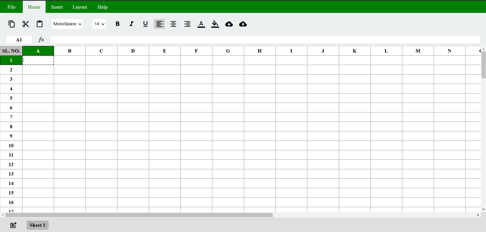
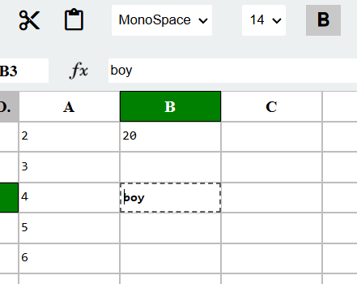
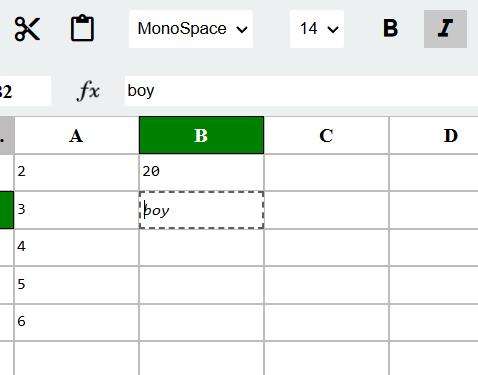
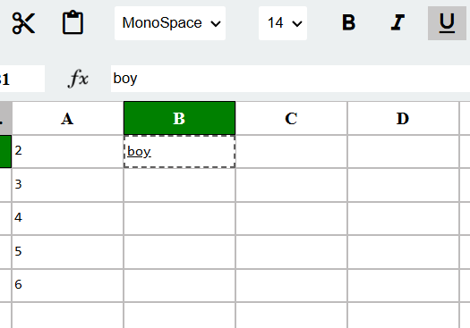
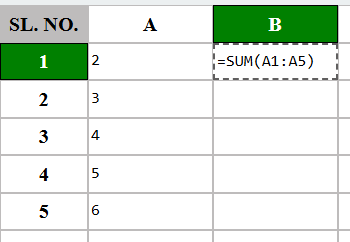
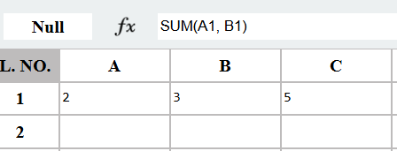

# Google Sheets Clone

## Overview

This project is a web application that mimics the user interface and core functionalities of Google Sheets. The primary focus is on providing a familiar spreadsheet experience with essential mathematical and data quality functions, data entry capabilities, and intuitive UI interactions.

## Features

### 1. Spreadsheet Interface:

* **Google Sheets UI:** The application is designed to closely resemble the visual design and layout of Google Sheets, including the toolbar, formula bar, and cell structure.

  
*Spreadsheet Interface*

* **Drag Functions:** Implemented drag functionality for cell content, formulas, and selections, mirroring Google Sheets' behavior.

* **Cell Dependencies:** Formulas and functions accurately reflect cell dependencies, updating accordingly when changes are made to related cells.

* **Basic Cell Formatting:** Supports basic cell formatting options, including bold, italics, font size, and color.

<div align="center">
  
  
  
  <br>
  <em>Figure 2: Basic Cell Formatting - Bold, Italic, and Underline</em>
</div>  


* **Row and Column Management:** Users can easily add, delete, and resize rows and columns.

### 2. Mathematical Functions:

* **SUM:** Calculates the sum of a range of cells (e.g., `=SUM(A1:A5)`).
* **AVERAGE:** Calculates the average of a range of cells (e.g., `=AVERAGE(B2:B10)`).
* **MAX:** Returns the maximum value from a range of cells (e.g., `=MAX(C3:C15)`).
* **MIN:** Returns the minimum value from a range of cells (e.g., `=MIN(D1:D20)`).
* **COUNT:** Counts the number of cells containing numerical values in a range (e.g., `=COUNT(E5:E25)`).

<div align="center">
  
  
  <br>
  <em>Figure 3: SUM Function Implementation and Example</em>
</div>


### 3. Data Quality Functions:

* **TRIM:** Removes leading and trailing whitespace from a cell (e.g., `=TRIM(A1)`).
* **UPPER:** Converts the text in a cell to uppercase (e.g., `=UPPER(B2)`).
* **LOWER:** Converts the text in a cell to lowercase (e.g., `=LOWER(C3)`).
* **REMOVE_DUPLICATES:** Removes duplicate rows from a selected range (e.g., `=REMOVE_DUPLICATES(A1:C5)`).
* **FIND_AND_REPLACE:** Allows users to find and replace specific text within a range of cells (e.g., `=FIND_AND_REPLACE(A1:B2, apple, orange)`).

### 4. Testing:

* Provides a means for users to test the implemented functions with their own data.
* Displays the results of function execution clearly within the cells.

## Tech Stack

* **HTML:** Provides the structure and layout of the spreadsheet.
* **CSS:** Styles the application to resemble Google Sheets, including the toolbar, cell grid, and other UI elements.
* **JavaScript:** Implements core functionalities, including:
  * Handling user input and cell updates.
  * Implementing mathematical and data quality functions.
  * Managing cell dependencies and formula calculations.
  * Providing data validation and testing mechanisms.

## Data Structures

* **Grid Representation:** The spreadsheet grid is represented using HTML `<div>` elements styled to mimic cells and rows. The `script.js` file dynamically creates these elements based on the grid size.
* **Cell State Management:** The application maintains a `cellState` object to track properties of each cell, such as font family, font size, bold/italic/underline styles, text alignment, content, and formula.
* **Formula Handling:** The formula bar is used to input formulas, which are then parsed and executed by JavaScript functions.
* **Dependency Tracking:** The application implements basic dependency tracking by storing the formula used in a cell and re-evaluating it when the values of the referenced cells change.

## Why This Tech Stack?

* **Simplicity:** HTML, CSS, and JavaScript are fundamental web technologies, making the project accessible and easy to understand.
* **Flexibility:** JavaScript provides the flexibility needed to implement the complex logic required for a spreadsheet application.
* **Compatibility:** The application runs in any modern web browser without requiring additional plugins or dependencies.
* **Rapid Prototyping:** HTML, CSS, and JavaScript enable rapid prototyping and iteration, making it possible to quickly implement and test new features.

## How to Run

1. Clone the repository:  
   ```sh
   git clone https://github.com/bikas295/mern-spreadsheet.git

## Live Demo

Check out the live demo of the project here: [Google Sheets Clone Live Demo](https://sidd444.github.io/Google-Sheet-Clone/) (https://bikas295.github.io/mern-spreadsheet/)


